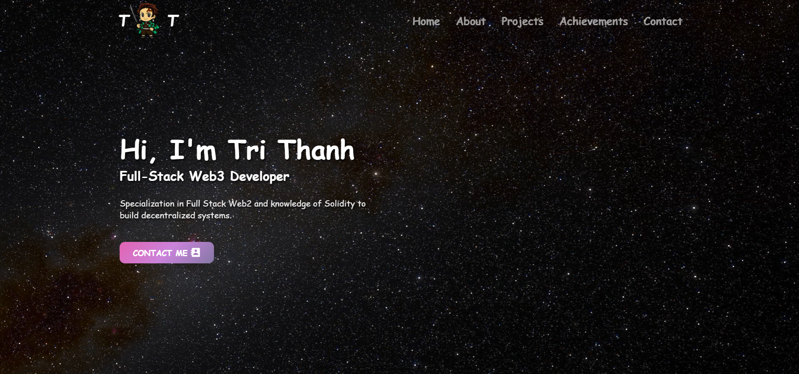
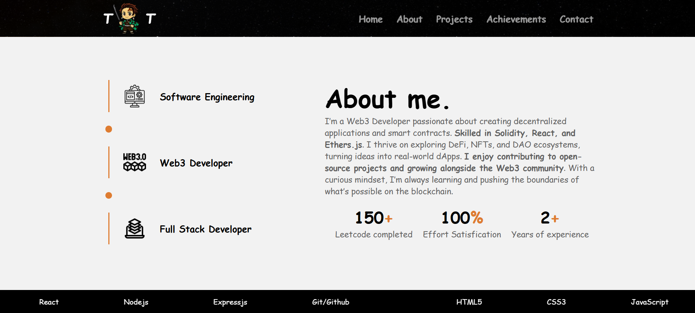
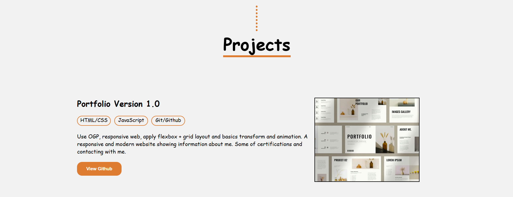
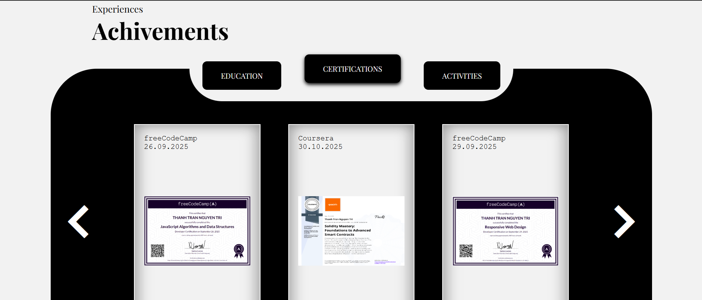
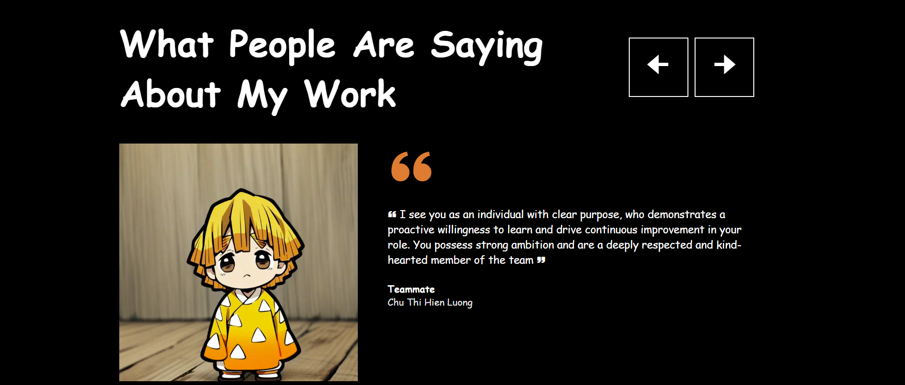
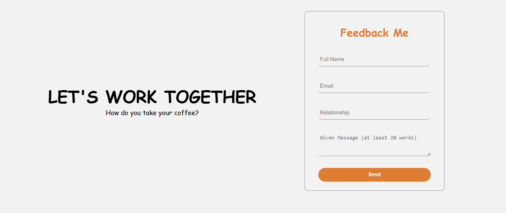

# 📌 Personal Portfolio Website

A clean and responsive **Personal Portfolio Website** built using **HTML, CSS, and JavaScript**, designed to showcase my projects, skills, and experience in a modern and visually appealing way.

---

## 🔗 Quick Links
- **Portfolio (Laptop 16"):** [Watch at here](https://tntt2305hcmus.github.io/tntt-portfolio-version1.0/)

---

## 🌟 Features

- Fully responsive UI  
- Modern, clean layout  
- Smooth scrolling & animations  
- Project showcase section  
- Contact form  
- Lightweight — no frameworks required  
- Fast loading, optimized assets  

---

## 🖼️ Preview

> ✨ *Below are screenshots of the actual portfolio UI.*

### 🏠 Home Page  


### 👨‍💻 About Section  


### 📂 Projects Section  


### 🏆 Achievement Section  


### 💬 Feedback Section  


### 📞 Contact Section  


---

## 🚀 Demo
 
🔗 **Repository:** https://github.com/TNTT2305hcmus/tntt-portfolio-version1.0

---

## 🛠️ Tech Stack

- **HTML5** — Page structure  
- **CSS3** — Styling, flexbox, conditions, shadowing, transition,...
- **JavaScript (ES6)** — Interactivity, DOM handling, Local Storage,...
- **GitHub Pages** — Management

---

## 📁 Folder Structure

```
📦 portfolio
┣ 📂 certification_img
┣ 📜 index.html
┣ 📜 style.css
┣ 📜 script.js
┗ 📜 README.md
```

---

## ⚙️ Installation & Usage

1. **Clone the project:**

```bash
git clone https://github.com/TNTT2305hcmus/tntt-portfolio-version1.0.git
```

2. **Open directly in your browser:**

```
index.html
```

3. **Deploy on GitHub Pages:**

- Go to **Settings** → **Pages**
- Select **Branch:** `main`
- Select **Folder:** `/Portfolio_version_1.0`
- Click **Save** 🎉

---

## 🧑‍💻 Author

**Tran Nguyen Tri Thanh**

📧 Email: trannguyentrithanh38@gmail.com
🌐 Facebook: [@TriThanh](https://www.facebook.com/tri.thanh.791990)
🐙 GitHub: [@TranNguyenTriThanh](https://github.com/TNTT2305hcmus)

---

## 📄 License

Feel free to use it for your own portfolio! I'm very happy about that.

---

## 🤝 Contributing

Contributions, issues, and feature requests are welcome!  
Feel free to check the [issues page](https://github.com/TNTT2305hcmus/tntt-portfolio-version1.0).

---

## ⭐ Show your support

Give a ⭐️ if you like this project!

---

**Made with ❤️ by Tran Nguyen Tri Thanh**
